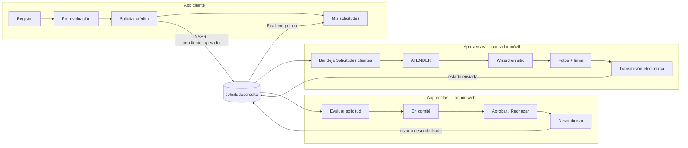

# Briefing: flujo crédito Cliente → Operador → Administrador

Documento para el equipo de **appbanco_pichincha_cliente**.  
La app **ventas** (operador + administrador) y la base **Supabase** ya están preparadas. Este archivo indica qué revisar y qué completar en la app cliente para cerrar el flujo de punta a punta.

**Proyecto Supabase compartido:** `APP_Mi_Banco_VRC` — ref `ipiqcrlpepoajvsbhnun`  
**URL:** `https://ipiqcrlpepoajvsbhnun.supabase.co` (misma `anonKey` en ambas apps)

---

## 1. Flujo de negocio (objetivo)



### Secuencia resumida

| # | Actor | Acción | Estado en DB |
|---|--------|--------|--------------|
| 1 | Cliente | Se registra en la app | — |
| 2 | Cliente | Pre-evalúa y **solicita crédito** | `pendiente_operador` |
| 3 | Operador | Ve bandeja global y pulsa **ATENDER** | `en_atencion` + `asesorid` |
| 4 | Operador | Visita al cliente, completa wizard, fotos, firma | `documentos_pendientes` → `completa` |
| 5 | Operador | Transmite electrónicamente | `enviada` |
| 6 | Administrador | Recibe en comité | `en_comite` |
| 7 | Administrador | Aprueba o rechaza | `aprobada` / `rechazada` |
| 8 | Administrador | Registra desembolso | `desembolsada` |
| 9 | Cliente | Ve avances en **Mis solicitudes** | Realtime por `dni` |

---

## 2. Estado del trabajo por app

### App ventas (operador + administrador) — **LISTO**

No requiere más cambios para el flujo base.

| Funcionalidad | Dónde | Estado |
|---------------|--------|--------|
| Bandeja global de solicitudes de clientes | Menú → **Solicitudes clientes** | ✅ |
| Tomar solicitud (asignación al operador) | Botón **ATENDER** | ✅ |
| Continuar solicitud en atención | Pestaña **Mis en atención** | ✅ |
| Wizard pre-cargado con datos del cliente | `solicitud_credito_wizard_screen.dart` | ✅ |
| Actualización de fila existente (no duplica) | `solicitud_credito_service.dart` | ✅ |
| Captura documentos + transmisión | Flujo existente | ✅ |
| Evaluación admin: comité → aprobar → desembolsar | Portal web → **Solicitudes** → **Evaluar** | ✅ |

**Archivos clave (repo ventas):**

- `lib/app/view/home/bandeja_solicitudes_cliente_screen.dart`
- `lib/app/services/solicitud_bandeja_cliente_service.dart`
- `lib/app/view/web/admin/admin_solicitud_evaluacion_screen.dart`
- `lib/app/services/admin_solicitud_evaluacion_service.dart`

### Supabase — **MIGRACIONES APLICADAS** (19 jun 2026)

Ejecutadas en el proyecto remoto:

| Migración | Qué hace |
|-----------|----------|
| `flujo_cliente_operador` | Columna `origen`, `asesorid` nullable, campos parciales para solicitud mínima, índices |
| `solicitudescredito_estados_check` | CHECK de `estado` ampliado (incluye `pendiente_operador`, `en_atencion`, `en_comite`, `desembolsada`, etc.) |
| `solicitudescredito_defaults_cliente` | Defaults para insert mínimo (`estadocivil`, `gradoinstruccion`, etc.) |

**Realtime:** tabla `solicitudescredito` ya está en publicación `supabase_realtime`.

**Insert de prueba validado:** fila con `estado = pendiente_operador` y `origen = app_cliente` inserta correctamente.

### App cliente — **REVISAR Y COMPLETAR**

Hay cambios **propuestos** en el repo cliente (rama local). Debes **verificar que estén mergeados** y probar end-to-end.

---

## 3. Checklist para el equipo cliente

### 3.1 Obligatorio (bloquea el flujo)

- [ ] **`lib/app/services/solicitud_credito_service.dart`**  
  Debe existir el método `crearSolicitudDesdePreEvaluacion()` que hace **INSERT** en `solicitudescredito` con:
  - `estado`: `'pendiente_operador'`
  - `origen`: `'app_cliente'`
  - **Sin** `asesorid` (null hasta que un operador atienda)
  - Datos del perfil: `dni`, `nombres`, `apellidos`, `telefono`, `email`
  - Datos de la pre-evaluación: `monto`, `ingresosestimados`, `tiponegocio`, `destinocredito`
  - Valores fijos recomendados: `plazomeses: 12`, `moneda: 'PEN'`, `tea: 28`, `tipocuota: 'fija'`, `tipogarantia: 'personal'`, `codigociiu: '4711'`, `antiguedadmeses: 6`

- [ ] **`lib/app/view/simulador/preevaluacion_screen.dart`**  
  El botón **“Solicitar crédito con un asesor”** debe llamar al servicio anterior (no solo mostrar un diálogo). Tras éxito, navegar a **Mis solicitudes** (`/solicitudes`).

- [ ] **`lib/app/core/estado_solicitud.dart`**  
  Debe reconocer estos valores DB (etiquetas en UI):
  - `pendiente_operador` → *Esperando asignación*
  - `en_atencion` → *Operador asignado*
  - `documentos_pendientes`, `completa`, `enviada`, `en_comite`, `aprobada`, `rechazada`, `desembolsada`

- [ ] **`lib/app/view/solicitudes/solicitudes_screen.dart`**  
  Debe listar la solicitud recién creada filtrando por `dni` del cliente autenticado.

- [ ] **Probar insert real** desde la app contra Supabase compartido (no mock). Si falla, revisar RLS (sección 5).

### 3.2 Recomendado (mejora UX, no bloquea)

- [ ] Evitar solicitudes duplicadas: antes de insertar, comprobar si ya existe una activa (`pendiente_operador`, `en_atencion`, `documentos_pendientes`, `completa`, `enviada`, `en_comite`) para el mismo `dni`.
- [ ] Suscripción Realtime también en evento **INSERT** (hoy solo UPDATE en algunos builds).
- [ ] Mensajes claros por estado en `solicitudes_screen.dart` (ej. “Un operador te visitará pronto”).
- [ ] Permitir subir documentos desde cliente cuando `estado` sea `documentos_pendientes` (ya existe lógica en `detalle_solicitud_screen.dart` — validar que funcione tras el flujo operador).

### 3.3 Opcional (fase 2)

- [ ] Notificaciones push al cliente (tabla `clientes_fcmtokens` ya existe en Supabase).
- [ ] Columna `clienteid` (FK a `clientes.id`) además de `dni`.
- [ ] Wizard completo de solicitud 100% en app cliente (hoy el operador completa en visita).
- [ ] Eliminar código muerto: `prestamo_service.dart` / tabla `solicitudesprestamo` (no usado en el flujo principal).

---

## 4. Contrato de datos — tabla `solicitudescredito`

### 4.1 INSERT desde app cliente (solicitud mínima)

```json
{
  "estado": "pendiente_operador",
  "origen": "app_cliente",
  "dni": "12345678",
  "nombres": "Juan",
  "apellidos": "Pérez",
  "telefono": "999888777",
  "email": "juan@correo.com",
  "monto": 8000,
  "ingresosestimados": 3500,
  "tiponegocio": "Comercio",
  "destinocredito": "Capital de Trabajo",
  "plazomeses": 12,
  "moneda": "PEN",
  "tipocuota": "fija",
  "tipogarantia": "personal",
  "tea": 28,
  "codigociiu": "4711",
  "antiguedadmeses": 6
}
```

**No enviar** `asesorid` en este paso.  
Campos que el operador completa después: `fechanacimiento`, `nombrenegocio`, `direccionnegocio`, `firmadigital`, documentos en `solicitudesdocumentos`.

### 4.2 Estados válidos (CHECK en DB)

```
pendiente_operador | en_atencion | documentos_pendientes | completa |
enviada | en_comite | aprobada | rechazada | desembolsada
(+ legacy: pendiente, en_revision)
```

### 4.3 Seguimiento cliente

- **SELECT:** `solicitudescredito` WHERE `dni` = documento del cliente logueado.
- **Realtime:** canal filtrado por `dni` en columna `dni`.
- **Documentos:** bucket `documentos-solicitudes`, tabla `solicitudesdocumentos`.

---

## 5. RLS y permisos (verificar)

La tabla `solicitudescredito` tiene **RLS activo**. Si el INSERT desde la app cliente falla con error de permisos:

1. Revisar políticas en Supabase Dashboard → Authentication → Policies → `solicitudescredito`.
2. Debe existir política que permita al **usuario autenticado** (cliente) insertar filas con su propio `dni` y `origen = app_cliente`.
3. Debe permitir **SELECT/UPDATE** solo de filas donde `dni` coincida con el documento del JWT/metadata del cliente.

Ejemplo de política (orientativa — ajustar según auth real):

```sql
-- INSERT: cliente crea solicitud propia
create policy "cliente_insert_solicitud"
on public.solicitudescredito for insert
to authenticated
with check (
  dni = (select documento from public.clientes where auth_user_id = auth.uid() limit 1)
);

-- SELECT: cliente ve solo las suyas
create policy "cliente_select_solicitud"
on public.solicitudescredito for select
to authenticated
using (
  dni = (select documento from public.clientes where auth_user_id = auth.uid() limit 1)
);
```

> Si hoy las políticas son `anon` abiertas, el insert puede funcionar sin cambios; conviene endurecerlas en producción.

---

## 6. Código de referencia (app cliente)

### Servicio — insert solicitud

Archivo: `lib/app/services/solicitud_credito_service.dart`

```dart
Future<CrearSolicitudClienteResult> crearSolicitudDesdePreEvaluacion({
  required ClienteModel cliente,
  required double monto,
  required double ingresos,
  required String tipoNegocio,
  required String destino,
}) async {
  // 1) Opcional: comprobar solicitud activa existente por dni
  // 2) INSERT con estado pendiente_operador, origen app_cliente
  // 3) Retornar id de la solicitud creada
}
```

### Pantalla — botón conectado

Archivo: `lib/app/view/simulador/preevaluacion_screen.dart`

- Tras pre-evaluación favorable u observada, mostrar botón **Solicitar crédito con un asesor**.
- Al pulsar: llamar servicio → mostrar confirmación → ir a `/solicitudes`.

### Enum estados

Archivo: `lib/app/core/estado_solicitud.dart`

Debe incluir `pendienteOperador`, `enAtencion`, `completa` y mapear los `dbValue` exactos de la tabla.

---

## 7. Prueba end-to-end (aceptación)

### Paso A — Cliente (app cliente)

1. Registrar usuario nuevo (o usar uno de prueba).
2. Ir a **Simulador / Pre-evaluación**.
3. Completar ingresos, monto, tipo negocio, destino.
4. Pulsar **Solicitar crédito con un asesor**.
5. **Esperado:** mensaje de éxito; en **Mis solicitudes** aparece fila con estado *Esperando asignación*.

Verificar en Supabase:

```sql
SELECT id, dni, estado, origen, monto, createdat
FROM solicitudescredito
WHERE dni = '<DNI_CLIENTE>'
ORDER BY createdat DESC
LIMIT 1;
-- estado = pendiente_operador, origen = app_cliente, asesorid IS NULL
```

### Paso B — Operador (app ventas, móvil)

1. Login con perfil operador.
2. Menú → **Solicitudes clientes**.
3. Pestaña **Nuevas** → debe aparecer la solicitud del paso A.
4. **ATENDER** → wizard pre-cargado → completar 4 pasos + firma.
5. Capturar documentos obligatorios → **Transmitir electrónicamente**.
6. **Esperado:** estado `enviada` en **Estado solicitudes**.

### Paso C — Administrador (app ventas, web)

1. Login web con perfil **administrador**.
2. **Solicitudes** → pestaña **Enviadas** → **Evaluar**.
3. **Recibir en comité** → **Aprobar crédito** → **Registrar desembolso**.
4. **Esperado:** estados `en_comite` → `aprobada` → `desembolsada`.

### Paso D — Cliente (seguimiento)

1. Volver a **Mis solicitudes** en app cliente.
2. **Esperado:** estados actualizados (Realtime o al refrescar).

---

## 8. SQL útil para depuración

```sql
-- Bandeja del operador (nuevas)
SELECT id, nombres, apellidos, dni, monto, estado, origen, createdat
FROM solicitudescredito
WHERE estado = 'pendiente_operador'
ORDER BY createdat DESC;

-- Solicitudes en atención de un operador
SELECT id, nombres, dni, monto, asesorid, estado
FROM solicitudescredito
WHERE estado = 'en_atencion'
ORDER BY createdat DESC;

-- Historial de un cliente
SELECT id, estado, origen, monto, asesorid,
       fechaeenvio, fechaaprobacion, fechadesembolso, motivorechazo
FROM solicitudescredito
WHERE dni = '12345678'
ORDER BY createdat DESC;
```

---

## 9. Notificaciones (opcional, no implementado en flujo base)

| Evento | Destinatario | Estado actual |
|--------|--------------|---------------|
| Solicitud pasa a `en_comite` | Operador (FCM) | Edge Function `notificar-solicitud` |
| Crédito `aprobada` / `rechazada` / `desembolsada` | Operador | ✅ configurado en ventas |
| Nueva solicitud `pendiente_operador` | Operador | ❌ pendiente |
| Cambio de estado | Cliente | ❌ pendiente (`clientes_fcmtokens` existe) |

Guías en repo ventas: `docs/GUIA_NOTIFICACIONES_AUTOMATICAS.md`, `docs/GUIA_FCM_FIREBASE.md`.

---

## 10. Resumen para el chat / ticket de app cliente

**Pedido al equipo cliente:**

> Integrar el flujo de solicitud de crédito con la base compartida Supabase (`ipiqcrlpepoajvsbhnun`).  
> Tras la pre-evaluación, el botón debe **insertar** en `solicitudescredito` con `estado = pendiente_operador` y `origen = app_cliente`.  
> El operador (app ventas) ya tiene bandeja **Solicitudes clientes** para tomar y completar la solicitud; el admin ya aprueba en portal web.  
> Revisar checklist sección 3, contrato sección 4, RLS sección 5 y ejecutar prueba E2E sección 7.  
> Documento de referencia: `docs/BRIEFING_APP_CLIENTE_FLUJO_CREDITO.md` (repo ventas).

---

*Última actualización: 19 jun 2026 — migraciones Supabase aplicadas; ventas operador/admin listos.*
