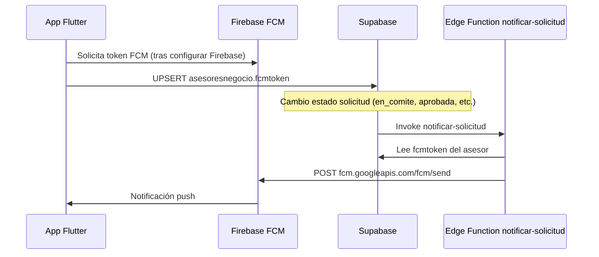

# Guía: Firebase Cloud Messaging (FCM) — App Pichincha Ventas

Esta guía describe **todo lo que debes configurar manualmente** en Firebase y Supabase. El código de la app ya guarda el token en `asesoresnegocio` y la Edge Function `notificar-solicitud` envía push cuando cambia el estado de una solicitud.

---

## 1. Resumen del flujo



**Eventos implementados en la Edge Function:**

| Tipo (`tipo` en body) | Cuándo usarlo | Mensaje |
|----------------------|---------------|---------|
| `recibido_comite` | Al pasar a `en_comite` | Recibido en comité |
| `aprobado` | Estado `aprobada` | Monto y fecha desembolso |
| `rechazado` | Estado `rechazada` | Motivo en `motivorechazo` |
| `desembolsado` | Estado `desembolsada` | Confirmación desembolso |

---

## 2. Crear proyecto en Firebase Console

1. Entra a [Firebase Console](https://console.firebase.google.com/).
2. **Agregar proyecto** (o usa uno existente del banco).
3. Nombre sugerido: `Pichincha-Ventas-Oficial` (o el estándar de tu área).

---

## 3. Registrar la app Android

1. En el proyecto Firebase → **Agregar app** → **Android**.
2. **Nombre del paquete Android** (`applicationId`):
   - Abre `android/app/build.gradle.kts` (o `build.gradle`) y copia el valor de `applicationId`.
   - Ejemplo típico: `com.pichincha.ventas` o el que ya tenga tu proyecto.
3. Descarga **`google-services.json`**.
4. Colócalo en:
   ```
   android/app/google-services.json
   ```
5. En `android/build.gradle.kts` (nivel proyecto), asegura el plugin Google services:
   ```kotlin
   plugins {
       id("com.google.gms.google-services") version "4.4.2" apply false
   }
   ```
6. En `android/app/build.gradle.kts` (nivel app):
   ```kotlin
   plugins {
       id("com.android.application")
       id("com.google.gms.google-services")
   }
   ```

---

## 4. Registrar la app iOS (si aplica)

1. Firebase → **Agregar app** → **iOS**.
2. **Bundle ID**: el de `ios/Runner.xcodeproj` → `PRODUCT_BUNDLE_IDENTIFIER`.
3. Descarga **`GoogleService-Info.plist`** → `ios/Runner/GoogleService-Info.plist`.
4. En Xcode: Runner → **Signing & Capabilities** → **+ Capability** → **Push Notifications**.
5. Sube la **APNs Auth Key** (.p8) en Firebase → Project Settings → Cloud Messaging → Apple.

---

## 5. Dependencias Flutter (paso manual en el proyecto)

En `pubspec.yaml` agrega (versiones pueden ajustarse):

```yaml
dependencies:
  firebase_core: ^3.13.0
  firebase_messaging: ^15.2.5
```

Ejecuta:

```bash
flutter pub get
```

---

## 6. Inicializar Firebase en `main.dart` — **YA HECHO EN EL REPO**

El proyecto ya incluye esto en `lib/main.dart`:

- `import 'firebase_options.dart';` (generado por FlutterFire CLI)
- `await Firebase.initializeApp(options: DefaultFirebaseOptions.currentPlatform);`
- Handler en segundo plano: `firebaseMessagingBackgroundHandler`
- Después se inicializa Supabase y el login

**No copies imports sueltos en otro archivo:** solo van al inicio de `lib/main.dart`, que ya está configurado.

### Generar `firebase_options.dart` (recomendado)

Instala FlutterFire CLI:

```bash
dart pub global activate flutterfire_cli
flutterfire configure
```

Selecciona el proyecto Firebase y las plataformas Android/iOS. Esto crea `lib/firebase_options.dart`.

---

## 7. Obtener y guardar el token FCM en Supabase — **YA HECHO EN EL REPO**

- Servicio: `lib/app/services/fcm_messaging_service.dart`
- Guardado en Supabase: `lib/app/services/fcm_token_service.dart` → tabla `asesoresnegocio`
- Se ejecuta solo al **iniciar sesión** o **restaurar sesión** (`AuthOficialViewModel`)

Tras login, en consola debug verás: `FCM token guardado`. Verifica en Supabase → Table Editor → `asesoresnegocio`.

La tabla destino es **`asesores_fcmtokens`** (no confundir con `asesoresnegocio` del negocio):

```sql
asesores_fcmtokens (asesorid, fcmtoken, fcmtokenupdatedat, updatedat)
```

> Si en Table Editor ves `asesoresnegocio` sin columna `asesorid`, es normal: esa tabla es otra entidad. Los tokens FCM van en **`asesores_fcmtokens`**. Ejecuta `supabase/migrations/20260603_asesores_fcmtokens.sql`.

---

## 8. Credenciales para enviar push desde Supabase (HTTP v1 — sin clave Legacy)

En proyectos nuevos como **Pichincha-Ventas-Oficial**, la **Clave del servidor (Legacy)** suele estar **deshabilitada**. Eso es normal: Google ya no la recomienda.

**No cambies de FCM** por esto. La app Flutter sigue igual; solo configuras el servidor con una **cuenta de servicio (JSON)**.

### Paso A — Descargar el JSON (desde Firebase, sin la pantalla rota de Cloud)

1. [Firebase Console](https://console.firebase.google.com/) → proyecto **Pichincha-Ventas-Oficial**.
2. Engranaje **Configuración del proyecto** → pestaña **Cuentas de servicio**.
3. Botón **Generar nueva clave privada** → confirma → se descarga un `.json`.
4. Guárdalo en lugar seguro (**no** lo subas a Git).

### Paso B — Activar la API correcta (enlace directo)

El enlace “Administrar API” de Cloud Messaging a veces abre **googlecloudmessaging** (API antigua) y falla con error de carga.

Usa este enlace directo para la API actual (**Firebase Cloud Messaging**):

```
https://console.cloud.google.com/apis/library/fcm.googleapis.com?project=pichincha-ventas-oficial
```

1. Abre el enlace (sesión Google del mismo proyecto).
2. Pulsa **Habilitar** / **Activar**.
3. Si ya dice “API habilitada”, no hagas nada más.

Alternativa: Google Cloud → **APIs y servicios** → **Biblioteca** → busca **“Firebase Cloud Messaging API”** (no “Google Cloud Messaging”).

### Paso C — Secret en Supabase

1. Abre el archivo `.json` con un editor de texto.
2. Copia **todo** el contenido (una sola línea o varias, debe ser JSON válido).
3. Supabase Dashboard → **Project Settings** → **Edge Functions** → **Secrets** → **New secret**:
   - **Name:** `FCM_SERVICE_ACCOUNT_JSON`
   - **Value:** pega el JSON completo
4. Despliega la función:
   ```bash
   supabase functions deploy notificar-solicitud --no-verify-jwt
   ```

### ¿Y la clave Legacy?

No la necesitas. Si en el futuro Google la habilitara, la función aún acepta `FCM_SERVER_KEY` como respaldo, pero **prioriza siempre** `FCM_SERVICE_ACCOUNT_JSON`.

### Probar envío desde Firebase (sin Supabase) — guía paso a paso

Objetivo: comprobar que **tu celular recibe una notificación** antes de configurar Supabase. No necesitas publicar una campaña real a todos los usuarios.

#### ¿Cuál opción elegir: Notifications o In-App?

| Opción en Firebase | ¿Usarla para push? |
|--------------------|-------------------|
| **Mensajes de Firebase Notifications** (notificaciones push) | **SÍ — elige esta** |
| **Mensajes desde la app de Firebase** (In-App Messaging) | **NO** — solo banners dentro de la app abierta, no es FCM push |

---

#### PARTE 1 — Obtener el token FCM de tu celular

1. Conecta el teléfono por USB (o usa el mismo dispositivo que ya usaste con `flutter run`).
2. En PowerShell, en la carpeta del proyecto:
   ```powershell
   cd "D:\Flutter\PichinchaApps\appbanco_pichincha_ventas"
   flutter run
   ```
3. Cuando abra la app, **inicia sesión** (ej. código `100001`, contraseña `asesor123`).
4. En el teléfono, cuando pregunte por **notificaciones**, pulsa **Permitir**.
5. Mira la **ventana de la terminal** donde corre `flutter run`. Busca un bloque como:
   ```text
   ========== FCM TOKEN (copiar para prueba en Firebase) ==========
   dK7x...muy_largo...abc
   ================================================================
   ```
6. **Copia todo el token** (una sola línea larga, sin espacios al inicio/final). Guárdalo en el Bloc de notas.

Si no aparece el token:
- Cierra sesión y vuelve a entrar, o reinicia la app (`r` en la terminal de Flutter).
- Confirma que `google-services.json` está en `android/app/`.

---

#### PARTE 2 — Enviar mensaje de prueba en Firebase Console

1. Abre [Firebase Console](https://console.firebase.google.com/) → proyecto **Pichincha-Ventas-Oficial**.
2. Menú izquierdo → **Engage** (o **Compromiso**) → **Messaging** (Mensajería).
3. Pulsa **Crear tu primera campaña** o **Nueva campaña**.
4. En la pantalla **“Selecciona el tipo de mensaje”**:
   - Elige **Mensajes de Firebase Notifications** (icono de campana / notificación).
   - **No** elijas “Mensajes desde la app de Firebase”.
5. Pulsa **Crear**.

**Paso 1 — Notificación (contenido)**  
Rellena solo lo mínimo:
- **Título de la notificación:** `Prueba Pichincha`
- **Texto de la notificación:** `Si ves esto, FCM funciona`
- Imagen / nombre adicional: **déjalos vacíos**
- Pulsa **Siguiente**

**Paso 2 — Destino (MUY IMPORTANTE)**  
Aquí no envíes aún a “toda la audiencia”. Busca el botón o enlace:
- **“Enviar mensaje de prueba”** / **“Send test message”**  
  (suele estar arriba a la derecha o debajo del formulario de destino)

Si lo encuentras:
1. Pulsa **Enviar mensaje de prueba**.
2. En **“Agregar un token de registro de FCM”**, pega el token que copiaste de la terminal.
3. Pulsa **+** o **Agregar**.
4. Pulsa **Probar** / **Test**.

Si **no** ves “Enviar mensaje de prueba” en este paso:
- En **Destino**, elige **“Enviar mensaje de prueba”** si aparece como pestaña, o continúa hasta el resumen y busca **Probar campaña** con opción de token.
- En versiones recientes: en el paso 2 selecciona app **Android** `com.example.appbanco_pichincha_ventas` y busca de nuevo el enlace de prueba.

**Pasos 3, 4, 5 (programación, conversión, resumen)**  
Para una prueba rápida **no hace falta publicar la campaña** si ya usaste “Enviar mensaje de prueba”. Puedes **cancelar** o cerrar sin pulsar **Publicar**.

---

#### PARTE 3 — Qué deberías ver en el celular

| Situación de la app | Qué esperar |
|---------------------|-------------|
| App en **segundo plano** o pantalla bloqueada | Notificación en la barra superior del Android |
| App **abierta** en primer plano | En esta app verás un **SnackBar** abajo (código ya lo maneja) además o en lugar del banner del sistema |

Si no llega nada:
- Token mal copiado (prueba de nuevo tras login).
- Notificaciones desactivadas para la app en Ajustes → Apps → tu app → Notificaciones.
- Espera 1–2 minutos y reintenta “Probar”.

---

#### Resumen en una frase

**Notifications** (no In-App) → título y texto → **Enviar mensaje de prueba** → pegar token de la terminal → **Probar**, sin publicar campaña masiva.

---

## 9. Cuándo disparar cada notificación

**Configuración automática (recomendada):** sigue la guía paso a paso en **`docs/GUIA_NOTIFICACIONES_AUTOMATICAS.md`** (Database Webhook + despliegue de función).

Puedes invocar la Edge Function manualmente desde:

- **Database Webhook** (producción): ver guía automática arriba.
- **SQL manual** (pruebas):

```sql
-- Ejemplo: pasar a comité y notificar (desde SQL Editor + invoke manual)
update solicitudescredito
set estado = 'en_comite', fechacomite = now()
where id = 'UUID-DE-TU-SOLICITUD';
```

Invoke HTTP (reemplaza URL y anon key):

```bash
curl -X POST "https://TU_PROYECTO.supabase.co/functions/v1/notificar-solicitud" \
  -H "Content-Type: application/json" \
  -d '{"solicitud_id":"UUID","tipo":"recibido_comite"}'
```

| Cambio de estado | `tipo` |
|------------------|--------|
| → `en_comite` | `recibido_comite` |
| → `aprobada` | `aprobado` |
| → `rechazada` | `rechazado` |
| → `desembolsada` | `desembolsado` |

---

## 10. Habilitar Supabase Realtime (tablero en app)

En Supabase Dashboard → **Database** → **Publications** → `supabase_realtime`:

- Activa la tabla **`solicitudescredito`**.

O ejecuta:

```sql
alter publication supabase_realtime add table solicitudescredito;
```

Sin esto, el tablero **Estado solicitudes** no actualizará contadores en vivo.

---

## 11. Aplicar migración Bloque 8

En SQL Editor o CLI:

```bash
supabase db push
# o ejecuta manualmente:
# supabase/migrations/20260528_bloque8_transmision_solicitudes.sql
```

---

## 12. Pruebas end-to-end

1. **Migración** aplicada + Realtime activo.
2. **Login** en la app con un asesor demo.
3. Configura Firebase + guarda token (verifica en tabla `asesoresnegocio`).
4. Completa flujo: solicitud → documentos → **Transmitir electrónicamente**.
5. En SQL, cambia estado y llama `notificar-solicitud` con el `tipo` correcto.
6. El dispositivo debe recibir la notificación (app en background o cerrada).

### Probar sin dispositivo físico

- Firebase Console → **Cloud Messaging** → **Send test message** → pega el token FCM del log de la app.

---

## 13. Checklist de lo que el agente / CI no puede hacer por ti

| Tarea | Responsable |
|-------|-------------|
| Crear proyecto Firebase | Tú / equipo infra |
| Descargar `google-services.json` / plist | Tú |
| Subir APNs key (iOS) | Tú |
| Ejecutar `flutterfire configure` | Tú (local) |
| Crear secret `FCM_SERVER_KEY` en Supabase | Tú |
| Desplegar Edge Functions | Tú (`supabase functions deploy`) |
| Activar Realtime en `solicitudescredito` | Tú |
| Cuenta desarrollador Apple (push iOS) | Tú |
| Políticas de red / firewall hacia FCM | Infra |

---

## 14. Archivos relevantes en este repo

| Archivo | Rol |
|---------|-----|
| `lib/app/services/fcm_token_service.dart` | Guarda token en Supabase |
| `supabase/functions/notificar-solicitud/index.ts` | Envía push vía FCM |
| `supabase/migrations/20260528_bloque8_transmision_solicitudes.sql` | Columnas + `asesoresnegocio` + notas |
| `lib/app/view/home/solicitudes_tablero_screen.dart` | Tablero con Realtime |
| `lib/app/view/home/transmision_electronica_screen.dart` | Transmisión por pasos |

Cuando tengas Firebase configurado, integra `FcmMessagingService` en el login y avisa al equipo backend para enlazar webhooks de cambio de estado con `notificar-solicitud`.
