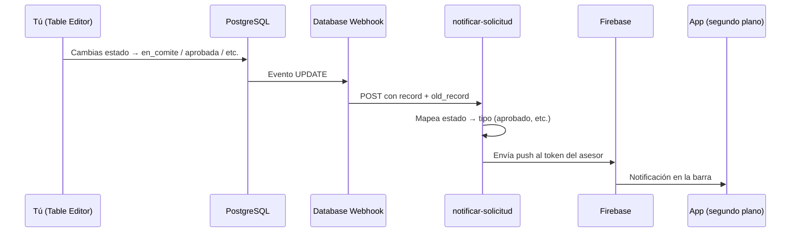

# Guía completa: notificaciones push automáticas al cambiar estado

Esta guía es para configurar **notificaciones 100 % automáticas**: cuando cambias el campo `estado` de una solicitud en Supabase (Table Editor, desplegable, SQL, o cualquier sistema), el asesor recibe un push en el celular **sin** abrir Firebase Console y **sin** invocar la función a mano.

**Requisito previo:** ya tengas funcionando FCM + `FCM_SERVICE_ACCOUNT_JSON` (ver `docs/GUIA_FCM_FIREBASE.md` secciones 2–8). Si la prueba manual con Firebase o `curl` ya te funcionó, puedes seguir aquí.

---

## 1. Qué vas a construir (en palabras simples)

Hoy tienes tres piezas sueltas:

| Pieza | Qué hace |
|-------|----------|
| App Flutter | Pide permiso, obtiene token FCM y lo guarda en `asesores_fcmtokens` al hacer login |
| Edge Function `notificar-solicitud` | Lee la solicitud, busca el token del asesor y envía el mensaje por Firebase |
| Table Editor (desplegable `estado`) | Solo guarda el nuevo estado en la base de datos |

Lo que falta para el **100 % automático** es un **enlace** entre “guardé un nuevo estado” y “llama a `notificar-solicitud`”. Ese enlace se llama **Database Webhook** en Supabase.



---

## 2. Estados que disparan notificación

Solo estos cambios de `estado` envían push (el resto se ignoran sin error):

| Nuevo valor en `estado` | Mensaje (tipo interno) |
|-------------------------|-------------------------|
| `en_comite` | Recibido en comité |
| `aprobada` | Crédito aprobado |
| `rechazada` | Solicitud rechazada |
| `desembolsada` | Desembolso realizado |

Estados como `enviada`, `completa`, `documentos_pendientes` **no** generan push (es normal).

**Importante:** el webhook solo actúa si el **estado cambió** (valor nuevo distinto al anterior). Si guardas la fila sin cambiar `estado`, no se envía nada.

---

## 3. Antes de empezar — verificación rápida

Marca cada ítem:

- [ ] Proyecto Supabase: `https://ipiqcrlpepoajvsbhnun.supabase.co` (o el tuyo si cambió).
- [ ] Secret `FCM_SERVICE_ACCOUNT_JSON` en **Project Settings → Edge Functions → Secrets**.
- [ ] Tabla `asesores_fcmtokens` existe (migración `20260603_asesores_fcmtokens.sql`).
- [ ] Hiciste login en la app y ves en terminal: `Supabase: guardado en asesores_fcmtokens`.
- [ ] En Table Editor → `asesores_fcmtokens` hay una fila con tu `asesorid` y un `fcmtoken` largo.
- [ ] `google-services.json` está en `android/app/`.
- [ ] Tienes instalado [Supabase CLI](https://supabase.com/docs/guides/cli) (opcional pero recomendado para desplegar).

---

## 4. Paso A — Actualizar y desplegar la Edge Function

El código del repo ya entiende el payload del **Database Webhook** además del invoke manual.

### A.1 — Desde tu PC (recomendado)

1. Abre PowerShell en la carpeta del proyecto:
   ```powershell
   cd "D:\Flutter\PichinchaApps\appbanco_pichincha_ventas"
   ```

2. Inicia sesión en Supabase (solo la primera vez):
   ```powershell
   supabase login
   ```

3. Enlaza el proyecto (solo la primera vez; usa el **Project ID** del dashboard):
   ```powershell
   supabase link --project-ref ipiqcrlpepoajvsbhnun
   ```

4. Despliega la función:
   ```powershell
   supabase functions deploy notificar-solicitud --no-verify-jwt
   ```

   `--no-verify-jwt` permite que el **webhook de base de datos** llame a la función sin JWT de usuario. La seguridad la refuerzas con el secret opcional del paso C.

5. Si el CLI pregunta por secrets, confirma que `FCM_SERVICE_ACCOUNT_JSON` sigue en el dashboard (el deploy no borra secrets).

### A.2 — Probar invoke manual (sanity check)

En Supabase Dashboard → **Edge Functions** → `notificar-solicitud` → pestaña que permita probar / **Invoke**:

```json
{
  "solicitud_id": "PEGA-AQUI-EL-UUID-DE-UNA-SOLICITUD",
  "tipo": "aprobado"
}
```

Respuesta esperada: `"ok": true` (no `"Sin token FCM"`).

Si falla aquí, **no** configures el webhook todavía; arregla FCM primero (`GUIA_FCM_FIREBASE.md`).

---

## 5. Paso B — Crear el Database Webhook (automático al guardar estado)

### B.1 — Abrir la pantalla de webhooks

1. Entra a [Supabase Dashboard](https://supabase.com/dashboard).
2. Abre tu proyecto.
3. Menú izquierdo → **Database** → **Webhooks** (en algunas versiones: **Integrations** → **Database Webhooks**).
4. Pulsa **Create a new webhook** / **Enable Webhooks** si es la primera vez.

### B.2 — Datos del webhook (copia exacta)

| Campo | Valor |
|-------|--------|
| **Name** | `notificar-cambio-estado-solicitud` |
| **Table** | `solicitudescredito` |
| **Schema** | `public` |
| **Events** | Solo **Update** (desmarca Insert y Delete) |
| **Webhook type** | `HTTP Request` |
| **Method** | `POST` |
| **URL** | `https://ipiqcrlpepoajvsbhnun.supabase.co/functions/v1/notificar-solicitud` |

Si tu proyecto usa otra URL, sustituye el subdominio por el de **Project Settings → API → Project URL**.

### B.3 — Headers HTTP (obligatorios)

En la sección **HTTP Headers**, agrega:

| Header | Valor |
|--------|--------|
| `Content-Type` | `application/json` |
| `Authorization` | `Bearer TU_SERVICE_ROLE_KEY` |

**Dónde sacar `SERVICE_ROLE_KEY`:**

1. **Project Settings** → **API**.
2. Copia **`service_role` `secret`** (la clave larga que dice *secret*, no la `anon`).
3. El header completo queda: `Bearer eyJhbGci...` (un espacio después de Bearer).

> **Seguridad:** la `service_role` es poderosa. No la pegues en la app Flutter ni en Git. Solo en webhooks y backend.

### B.4 — Cuerpo del mensaje

Deja el comportamiento **por defecto** de Supabase: el webhook envía automáticamente un JSON con `type`, `table`, `record` (fila nueva) y `old_record` (fila anterior). **No** necesitas escribir un body personalizado.

La función ya traduce eso a `solicitud_id` + `tipo`.

### B.5 — Guardar

Pulsa **Create webhook** / **Confirm**. Debe aparecer en la lista como activo.

---

## 6. Paso C (recomendado) — Secret para proteger el webhook

Sin esto, cualquiera que conozca la URL podría intentar llamar la función. Con el secret, solo el webhook autorizado entra.

### C.1 — Crear un secret aleatorio

En PowerShell:

```powershell
[guid]::NewGuid().ToString()
```

Copia el resultado (ej. `a3f2c1d4-....`).

### C.2 — Guardarlo en Supabase

1. **Project Settings** → **Edge Functions** → **Secrets** → **New secret**.
2. **Name:** `WEBHOOK_SECRET`
3. **Value:** el GUID que generaste.
4. Guarda.

### C.3 — Añadir header al webhook

Edita el webhook que creaste → **HTTP Headers** → agrega:

| Header | Valor |
|--------|--------|
| `x-webhook-secret` | el mismo GUID |

### C.4 — Redesplegar la función

```powershell
supabase functions deploy notificar-solicitud --no-verify-jwt
```

Los secrets nuevos se leen al desplegar o en caliente según tu proyecto; si duda, redeploy.

---

## 7. Paso D — Prueba end-to-end (como usuario final)

### D.1 — Preparar el teléfono

1. `flutter run` en el dispositivo.
2. Login (ej. `100001` / `asesor123`).
3. Permite notificaciones.
4. Verifica token en `asesores_fcmtokens`.
5. Pulsa el botón **Inicio** del Android (app en **segundo plano**).

### D.2 — Preparar la solicitud en Supabase

1. **Table Editor** → `solicitudescredito`.
2. Elige una fila cuyo **`asesorid`** sea el mismo con el que iniciaste sesión.
3. Anota el **`id`** (UUID).

### D.3 — Cambiar estado con el desplegable

1. Columna **`estado`** → elige por ejemplo `aprobada`.
2. Si el negocio lo requiere, rellena `fechaaprobacion` o campos relacionados.
3. **Save** / guardar fila.

En unos segundos deberías ver la notificación **“Crédito aprobado”** en el teléfono.

### D.4 — Probar los otros estados

Repite cambiando el desplegable (una prueba por estado):

| Cambia `estado` a | Título aproximado en el celular |
|-------------------|----------------------------------|
| `en_comite` | Recibido en comité |
| `rechazada` | Solicitud rechazada (conviene tener `motivorechazo`) |
| `desembolsada` | Desembolso realizado |

### D.5 — Comportamiento con la app abierta

| Situación | Qué verás |
|-----------|-----------|
| App en segundo plano o cerrada | Banner en la barra de notificaciones |
| App abierta en primer plano | SnackBar abajo con botón “Ver” |

---

## 8. Cómo comprobar que el webhook sí se ejecutó

### 8.1 — Logs de la Edge Function

1. Dashboard → **Edge Functions** → `notificar-solicitud` → **Logs**.
2. Tras guardar en Table Editor, debería aparecer una invocación reciente.
3. Si el estado no era notificable, verás respuesta con `"omitido": true` (no es error).

### 8.2 — Logs del webhook

1. **Database** → **Webhooks** → tu webhook → **Logs** / historial.
2. Status **200** = la función respondió OK.
3. Status **401** = `WEBHOOK_SECRET` no coincide.
4. Status **500** = revisa logs de la función (FCM, JSON, etc.).

### 8.3 — Invoke manual sigue disponible

Para depurar sin tocar la tabla:

```powershell
curl -X POST "https://ipiqcrlpepoajvsbhnun.supabase.co/functions/v1/notificar-solicitud" `
  -H "Content-Type: application/json" `
  -H "Authorization: Bearer TU_SERVICE_ROLE_KEY" `
  -H "x-webhook-secret: TU_WEBHOOK_SECRET" `
  -d "{\"solicitud_id\":\"UUID\",\"tipo\":\"aprobado\"}"
```

(Omite el header `x-webhook-secret` si no configuraste `WEBHOOK_SECRET`.)

---

## 9. Solución de problemas

| Problema | Qué revisar |
|----------|-------------|
| Tablero en la app se actualiza pero **no** hay push | Webhook no creado, URL mal, o falta header `Authorization` |
| Webhook 401 | Header `x-webhook-secret` distinto al secret `WEBHOOK_SECRET` |
| Función: `"omitido": true` | Mismo estado que antes, o estado no es uno de los 4 notificables |
| `"Sin token FCM para el asesor"` | `asesorid` de la solicitud ≠ asesor con login; o tabla `asesores_fcmtokens` vacía |
| Webhook 200 pero no llega al celular | Token viejo: cierra sesión, login de nuevo; revisa permisos de notificaciones en Android |
| Error FCM en logs | `FCM_SERVICE_ACCOUNT_JSON` mal pegado; API FCM no habilitada en Google Cloud |
| Notificación duplicada | Dos webhooks iguales, o invoke manual + webhook a la vez |

---

## 10. Qué cambió en el código del repo

| Archivo | Cambio |
|---------|--------|
| `supabase/functions/notificar-solicitud/index.ts` | Acepta payload de Database Webhook; mapea `estado` → `tipo`; secret opcional |
| `lib/app/services/transmision_electronica_service.dart` | Se quitó invoke manual al asignar expediente (evita push “en comité” antes de tiempo) |
| `docs/GUIA_NOTIFICACIONES_AUTOMATICAS.md` | Esta guía |

**Flujo de negocio recomendado:** el push de comité llega cuando back-office pone `estado = en_comite`, no al terminar la transmisión del asesor.

---

## 11. Checklist final “100 % automático”

- [ ] `FCM_SERVICE_ACCOUNT_JSON` en secrets
- [ ] Función `notificar-solicitud` desplegada con código actualizado
- [ ] Webhook `UPDATE` en `solicitudescredito` apuntando a la función
- [ ] Header `Authorization: Bearer service_role`
- [ ] (Opcional) `WEBHOOK_SECRET` + header `x-webhook-secret`
- [ ] Token FCM del asesor en `asesores_fcmtokens`
- [ ] Prueba: cambiar desplegable `estado` con app en segundo plano → notificación llega

---

## 12. Referencias

- Configuración Firebase y token: `docs/GUIA_FCM_FIREBASE.md`
- Recordatorio de estado del Bloque 8: `docs/RECORDATORIOS_PROYECTO.md`
- Código FCM en app: `lib/app/services/fcm_messaging_service.dart`

Cuando completes el checklist, ya no necesitas Firebase Console para las notificaciones de estado: solo cambiar datos en Supabase (o que tu futuro back-office lo haga por API).
